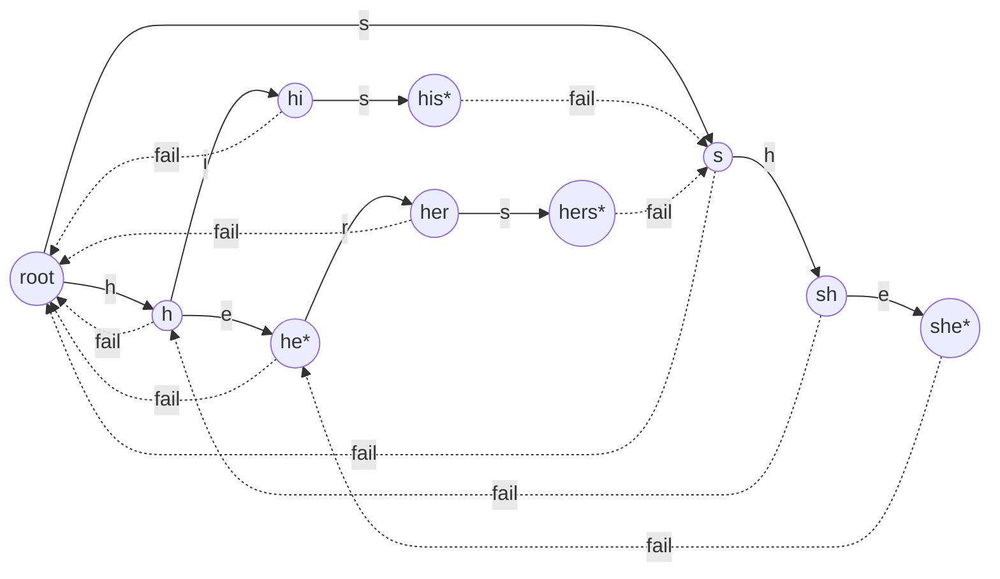

# Algoritmo — Aho-Corasick

> Este documento se incluye para profundizar en este algoritmo.
> Ejemplo visual:
> https://brunorb.github.io/ahocorasick/visualization.html

## Tabla de contenidos

1. [Motivación](#1-motivación)
2. [Intuición](#2-intuición)
3. [Complejidad formal](#3-complejidad-formal)
4. [Notas de implementación](#4-notas-de-implementación)
5. [Aplicación de leftmost-longest](#5-aplicación-de-leftmost-longest)
6. [Normalización y mapeo de posiciones](#6-normalización-y-mapeo-de-posiciones)
7. [Comparación con alternativas](#7-comparación-con-alternativas)
8. [Validación empírica](#8-validación-empírica)
9. [Lectura adicional](#9-lectura-adicional)

## 1. Motivación

El servicio de redacción recibe un documento `T` y una lista de censura `P = {p₁, p₂, …, pₖ}`
y debe reportar cada ocurrencia de cualquier `pᵢ` en `T` para que el constructor de
chunks aguas abajo pueda insertar tokens `XXXX` en los offsets correctos. El conjunto `P`
se proporciona por solicitud y no está acotado por un vocabulario fijo ni es conocido
en tiempo de compilación.

Un bucle ingenuo con `String.indexOf` sobre cada patrón se ejecuta en `O(|T| · Σ|pᵢ|)`,
lo que degrada rápidamente en cuanto las listas de censura crecen más allá de unos
cientos de entradas. Una sola expresión regular grande con alternancia
(`/p₁|p₂|…|pₖ/g`) colapsa los bucles en una sola llamada al motor, pero el tiempo de
ejecución depende del motor: el motor `RegExp` de V8 está basado en backtracking y no
ofrece garantía de linealidad en el peor caso, y expresar la semántica
leftmost-longest sobre la alternancia requiere bookkeeping adicional por cada
coincidencia.

Aho-Corasick nos da lo que el problema realmente quiere: **un único recorrido de
izquierda a derecha de `T`** que reporta cada hit en `O(|T| + Σ|pᵢ| + Z)` — donde `Z`
es el número de coincidencias reportadas — con un comportamiento determinista que
resulta directamente auditable. Esa linealidad es independiente del número de
patrones, lo cual importa porque la lista de censura es la dimensión que crece en
despliegues reales.

## 2. Intuición

Aho-Corasick se entiende mejor como KMP generalizado a un conjunto de patrones. El
algoritmo construye un trie a partir de `P`, lo aumenta con **enlaces de fallo**
(failure links), y luego recorre `T` un carácter a la vez, siguiendo aristas del
trie ante una coincidencia y enlaces de fallo ante un mismatch.

Considera el ejemplo clásico `P = {"he", "she", "his", "hers"}` recorrido contra
`T = "ushers"`.

**Paso 1 — construir el trie.** Cada patrón se inserta como un camino desde la raíz.
Los nodos marcados con `*` terminan un patrón.

**Paso 2 — conectar los enlaces de fallo.** Para cada nodo `n` a profundidad `d`, su
enlace de fallo apunta al nodo más profundo del trie cuya etiqueta es un sufijo
propio de la etiqueta de `n`. El enlace de fallo de la raíz apunta a sí misma; los
nodos de nivel 1 fallan hacia la raíz. Los nodos más profundos se calculan
mediante un BFS que sigue la cadena de fallo del padre.

**Paso 3 — propagar los outputs.** Un nodo hereda el conjunto de outputs de su
cadena de ancestros de fallo, de modo que las coincidencias que terminan dentro de
una coincidencia más larga se reportan sin volver a recorrer.

**Paso 4 — escanear.** Comienza en la raíz. Por cada carácter de entrada `c`:

- Si el nodo actual tiene un hijo etiquetado con `c`, desciende.
- De lo contrario, sigue los enlaces de fallo hasta que exista un hijo etiquetado
  con `c` (y desciende) o se alcance la raíz.
- Emite cada patrón en el conjunto de outputs del nodo actual, con el offset final
  anclado al carácter recién consumido.

Sobre `T = "ushers"` el recorrido reporta `"she"` terminando en el índice 4 y
`"he"` terminando en el mismo índice mediante la propagación de outputs vía
enlace de fallo — ambos con una sola pasada sobre el texto.

Las aristas sólidas son transiciones del trie; las aristas punteadas son enlaces de
fallo. Los nodos marcados con `*` son estados de aceptación que emiten su índice de
patrón.

## 3. Complejidad formal

Sea `n = |T|`, `m = Σ|pᵢ|` (suma de las longitudes de los patrones sobre el alfabeto
transformado) y `Z` el número de coincidencias reportadas.

- **Espacio** — `O(m)` para el trie, más `O(m)` para los enlaces de fallo y las
  listas de outputs, así que `O(m)` en total. No se requiere ninguna tabla
  auxiliar por posición de entrada.
- **Preprocesamiento** — `O(m)` vía BFS. Cada nodo se encola una vez; cada arista se
  recorre un número constante de veces al seguir las cadenas de fallo, lo cual se
  amortiza contra la profundidad.
- **Matching** — `O(n + Z)`. Cada carácter de `T` o avanza el autómata (trabajo
  amortizado constante incluyendo los recorridos de enlace de fallo, ya que la
  profundidad de descenso y los seguimientos de enlace de fallo forman un par
  crédito/débito) o emite una coincidencia vía la lista de outputs del nodo.
- **Total** — `O(n + m + Z)`.

Crucialmente, la cota de matching es **lineal en la longitud del texto
independientemente del número de patrones**. Duplicar `|P|` solo hace crecer el
trie; el escaneo de `T` no paga costo adicional más allá de conjuntos de outputs
más grandes en nodos compartidos.

Contrasta esto con la alternancia en regex. El motor `RegExp` de Node.js es
Perl-compatible basado en backtracking y no tiene garantía publicada de
linealidad en el peor caso — entradas patológicas pueden forzar comportamiento
exponencial. Incluso entradas bien comportadas dependen de heurísticas internas
del motor que no podemos auditar. La cota de Aho-Corasick es algorítmica, no
dependiente de la implementación.

## 4. Notas de implementación

El autómata concreto vive en [aho-corasick.service.ts](../src/redaction/matchers/aho-corasick.service.ts).
Algunas elecciones merecen comentario explícito.

**Transiciones por code-point.** Los hijos de un `TrieNode` viven en un
`Map<number, TrieNode>` indexado por code point Unicode, no por unidad de código
UTF-16 ni por byte crudo. Los patrones se recorren con un `for..of` sobre el string
(que itera a nivel de code point, sin conciencia de grafemas), y el matching de
texto llama a `String.prototype.codePointAt` e incrementa el índice en 2 para
caracteres astrales. Esto evita el bug de pares surrogados que los tries basados
en `charCodeAt` exhiben con emojis y otro texto del plano suplementario.

**Enlaces de fallo vía BFS.** Tras construir el trie, el enlace de fallo de la raíz
apunta a sí misma, los hijos de profundidad 1 fallan hacia la raíz, y los nodos
más profundos se procesan nivel por nivel. Para un nodo `n` con padre `p` y
arista entrante etiquetada `c`, `fail(n)` se calcula subiendo por `fail(p)` por la
cadena de fallo hasta encontrar un ancestro con un hijo etiquetado `c`; si
ninguno existe, `fail(n) = root`. Como cada nodo solo sube por su propia cadena
de fallo, el trabajo total es `O(m)`.

**Propagación de outputs en tiempo de construcción.** Cuando se establece el enlace
de fallo de un nodo, su lista de outputs se extiende con los outputs del nodo
destino. Esto convierte la emisión de coincidencias en tiempo de escaneo en una
sola lectura `O(|outputs|)`; no recorremos la cadena de fallo durante el matching.

**Separación compile / match.** `AhoCorasickMatcher` expone dos métodos:
`compile(patterns, options)` produce un `CompiledMatcher` que contiene el trie, la
lista de patrones transformados y las opciones resueltas; `match(text, compiled)`
solo lee esa estructura. La separación permite que el mismo autómata compilado
sirva a muchos documentos — un patrón prepared-statement que importa para
cualquier futuro endpoint batch — y garantiza que escanear un documento nunca
mute el matcher.

**Congelado post-compile.** Tras la construcción, un BFS sobre el trie llama
`Object.freeze` en cada nodo y en su arreglo `outputs`, y en el envoltorio
`CompiledMatcher`. Los arreglos `patterns` y `transformedPatterns` se congelan
antes de ser adjuntados. Esto previene mutaciones accidentales que se filtren
entre solicitudes y hace que el autómata compilado sea seguro para compartir
entre llamadas concurrentes a `match`.

**Branding de identificador.** `CompiledMatcher` lleva un literal `__matcherId`
(`'aho-corasick'`) de modo que pasar una estructura compilada producida por una
implementación distinta de matcher a `match` falla ruidosamente en vez de
retornar silenciosamente resultados equivocados. El chequeo corre una vez al
inicio de `match` y se borra a nivel de tipo por TypeScript — es una guarda de
runtime barata contra una clase de errores que el sistema de tipos no puede
prevenir por completo a través de fronteras de servicio.

## 5. Aplicación de leftmost-longest

Aho-Corasick por sí mismo reporta cada patrón que termina en la posición actual.
Si el trie contiene `"he"` y `"hers"`, escanear `"hers"` emite `"he"` en el índice
final 2 y `"hers"` en el índice final 4. Para la redacción elegimos una política
**leftmost-longest** de modo que el token de censura cubra la frase maximal y
los prefijos más cortos no re-redacten la misma región.

La aplicación es un post-filtro sobre la lista cruda de hits:

1. Ordenar los hits por `(start asc, length desc)`. Los empates en `start` colocan
   primero la coincidencia más larga.
2. Recorrer la lista ordenada una vez con un cursor `lastEnd`. Saltar cualquier hit
   cuyo `start < lastEnd`; de lo contrario emitirlo y avanzar `lastEnd` al end del
   hit.

La primera condición elige la coincidencia más larga en cada posición; la segunda
suprime la superposición con una coincidencia previamente emitida. Las dos juntas
dan leftmost-longest en una sola pasada lineal sobre la lista de hits.

La política **no es configurable**. Exponerla forzaría a cada consumidor aguas
abajo a razonar sobre dos formas de redacción, y no hemos encontrado un caso de
uso que justifique la complejidad. Está documentada como D-5 en
[DECISIONS.md](DECISIONS.md).

## 6. Normalización y mapeo de posiciones

El matcher soporta dos transformaciones ortogonales de la entrada: matching
case-insensitive (`caseSensitive: false`) y normalización Unicode
(`normalizeUnicode`). Ambas pueden cambiar la longitud del string. Pasar a
minúsculas el `I` turco sin punto (`U+0130`) produce una secuencia de dos code
points bajo el case folding por defecto de Unicode; NFKC puede expandir
ligaduras como `fi` (`U+FB01`) a `fi`.

Los patrones se transforman y almacenan en **forma normalizada**; el trie recorre
el texto normalizado. Pero las coincidencias reportadas a la capa de servicio
deben indexar en el **texto original** para que el constructor de chunks pueda
insertarlos sin re-transformar.

La implementación resuelve esto produciendo dos salidas paralelas durante la
transformación de texto:

- `normalized` — el string transformado que dirige el autómata.
- `offsetMap` — un arreglo tal que `offsetMap[i]` es el índice original
  correspondiente al inicio del carácter en el índice normalizado `i`. Tiene
  longitud `normalized.length + 1` de modo que el límite exclusivo del final
  del último carácter mapea limpiamente.

Cuando un hit se dispara en los índices normalizados `(nStart, nEnd)`, el matcher
traduce a coordenadas originales vía `offsetMap[nStart]` y `offsetMap[nEnd]`. Los
hits cuyo mapeo es indefinido — lo cual solo ocurre si una expansión parte un par
surrogado de manera que deja el límite final dentro de un grafema compuesto —
se descartan en vez de reportarse incorrectamente; las pruebas basadas en
propiedades no han producido tal caso, pero la guarda es barata y previene
corrupción silenciosa.

Cuando ni la normalización ni el case folding están activos, `offsetMap` es `null`
y el matcher usa los índices normalizados directamente, evitando la asignación
del arreglo para el camino común.

## 7. Comparación con alternativas

Evaluamos cinco alternativas antes de elegir Aho-Corasick. La columna de veredicto
registra si la alternativa sobrevive al matcher de producción, al suite de
pruebas, o si queda diferida.

| Algoritmo         | Complejidad temporal     | Espacio          | Fortalezas                                                                    | Debilidades                                                                     | Veredicto                         |
| ----------------- | ------------------------ | ---------------- | ----------------------------------------------------------------------------- | ------------------------------------------------------------------------------- | --------------------------------- |
| Bucle ingenuo     | `O(n · k · avg(\|pᵢ\|))` | `O(1)`           | Trivial de implementar                                                        | Cuasi-cuadrático; no aprovecha estructura compartida entre patrones             | Rechazado                         |
| Rabin-Karp        | `O(n + m)` prom.         | `O(m)`           | Rolling-hash simple; se extiende a variantes 2D / multi-longitud              | Requiere ventanas de patrones de longitud uniforme; peor caso `O(n · m)`        | Rechazado                         |
| Regex alternation | Dependiente del motor    | Dependiente      | Disponible en la librería estándar; sintaxis flexible                         | Riesgo de backtracking; difícil de auditar; leftmost-longest requiere post-work | **Baseline para pruebas property**|
| Commentz-Walter   | `O(n/μ)` prom.           | `O(m)`           | Sub-lineal en caso promedio con alfabetos grandes                             | Implementación compleja; ganancia marginal a nuestra escala; no mejora peor caso| Diferido                          |
| Wu-Manber         | `O(n/μ)` prom.           | `O(m · 2^q)`     | Basado en bloques, excelente para conjuntos de patrones muy grandes           | Sensible a tuning; memoria crece con el tamaño de bloque; complejidad de correctitud | Diferido                     |
| **Aho-Corasick**  | **`O(n + m + Z)`**       | **`O(m)`**       | **Peor caso lineal, determinista, auditable, compile reutilizable**           | Sin caso promedio sub-lineal                                                    | **Elegido para producción**       |

Aho-Corasick gana en los ejes que importan para este servicio: tiempo lineal
determinista (la auditabilidad es no-negociable en una pipeline de redacción),
un autómata compilado reutilizable (el patrón prepared-statement descrito en
D-12), y una prueba de correctitud que cabe en media página. Commentz-Walter y
Wu-Manber trocan un factor constante por complejidad sustancial de
implementación y ambos requieren tuning contra una distribución de patrones
para la cual aún no tenemos mediciones; quedan abiertos para los benchmarks de
la Fase 2.

## 8. Validación empírica

Las cotas de complejidad en el peor caso describen el algoritmo; no prueban que
nuestra implementación sea correcta. Cruzamos validación de `AhoCorasickMatcher`
contra `RegexMatcher` con pruebas basadas en propiedades en
[matchers.property.spec.ts](../src/redaction/matchers/matchers.property.spec.ts).

La estrategia:

1. `fast-check` genera patrones aleatorios y texto aleatorio a través de la
   matriz de opciones relevante (case sensitivity, word boundaries,
   normalización Unicode).
2. Ambos matchers consumen las mismas entradas con las mismas opciones.
3. El harness afirma que las secuencias `Match[]` emitidas son idénticas en
   longitud, orden, offsets y referencias a patrones.
4. Ante una divergencia, `fast-check` reduce a un contraejemplo mínimo y emite
   la seed para que el fallo se reproduzca de forma determinista.

Ninguno de los matchers se confía como el oráculo: el acuerdo entre dos
implementaciones derivadas independientemente es la evidencia. Cuando las
pruebas han marcado divergencias durante el desarrollo, consistentemente han
sacado a la luz bugs reales — más a menudo en casos borde de normalización o en
el ordenamiento del filtro de superposición — en vez de mismatches espurios. El
suite property corre `1000+` iteraciones por propiedad y ha atrapado regresiones
que el suite escrito a mano pasó por alto.

Las pruebas basadas en propiedades son la razón por la cual `RegexMatcher` existe
en primer lugar. No es un fallback de producción; es la implementación de
referencia cuya simplicidad la hace confiable como blanco de comparación. Ver
[regex.service.ts](../src/redaction/matchers/regex.service.ts) para la
implementación.

## 9. Lectura adicional

- Aho, A. V., & Corasick, M. J. (1975). _Efficient string matching: an aid to
  bibliographic search_. Communications of the ACM, 18(6), 333–340.
- Knuth, D. E., Morris, J. H., & Pratt, V. R. (1977). _Fast pattern matching in
  strings_. SIAM Journal on Computing, 6(2), 323–350. El ancestro de
  patrón-único de Aho-Corasick.
- Commentz-Walter, B. (1979). _A string matching algorithm fast on the average_.
  Proc. 6th ICALP, LNCS 71.
- Wu, S., & Manber, U. (1994). _A fast algorithm for multi-pattern searching_.
  Technical report TR-94-17, University of Arizona.
